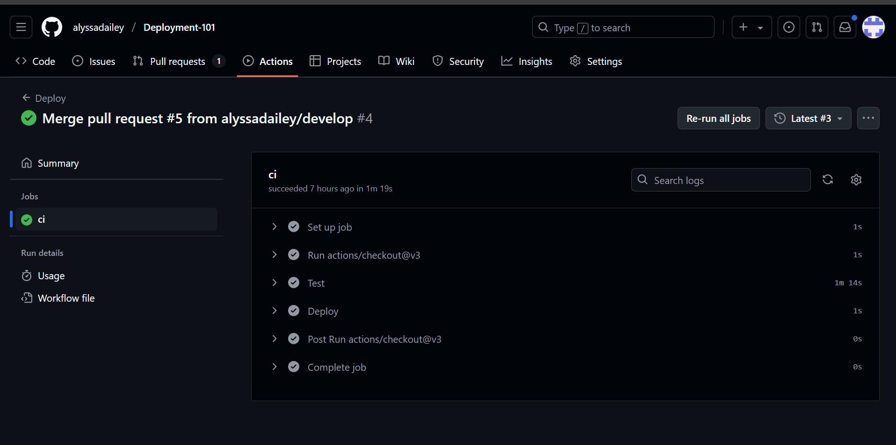
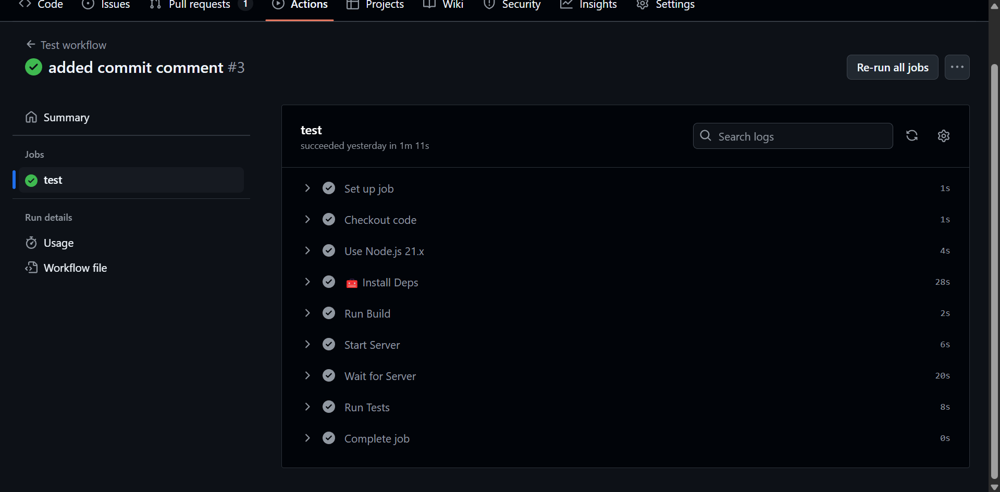

# Deployment 101

## Table of Contents
- [Description](#description)
- [Screenshots](#screenshots)
- [Installation](#installation)
- [Usage](#usage)
- [Features](#features)
- [License](#license)
- [Contributing](#contributing)
- [Tests](#tests)
- [Credit](#credit)
- [Project Links](#project-links)
- [Questions](#questions)

## Description

This application allows users to take a multiple-choice quiz and view their scores. The app was originally already built.

My contributions focused on implementing a CI/CD pipeline using GitHub Actions, which ensures that:

All pull requests to the develop branch automatically run the test suite.

Pushes to the develop branch trigger tests again, and if successful, the code is automatically merged into the main branch.

This automation helps keep the main branch clean and production-ready at all times.

## Screenshots

Here are some previews of the webpage:

###  Develop Test passing

### Feature Branch Tests Passing

## Installation

1. Clone the repo: 

https://github.com/alyssadailey/Deployment-101

2. Navigate into the project directory:

cd mern-quiz-app

3. Install server dependencies:

cd server
npm install

4. Install client dependencies:

cd ../client
npm install

5. Set up environment variables:

Create a .env file in the /server folder and add your MongoDB connection string:

MONGODB_URI= mongodb+srv://quizuser:<db_password>@cluster0.qltq3.mongodb.net/?retryWrites=true&w=majority&appName=Cluster0

6. Run servers:

npm run develop

## Usage

1. Navigate to the home page to start the quiz.

2. Answer each question before time runs out.

3. At the end of the quiz, view your score.

4. Admins or developers can use the backend API to manage quiz questions.

## Features

-Full MERN Stack application

-Dynamic quiz experience with timed questions

-Score tracking and user feedback

-GitHub Actions CI/CD workflo

-Auto-test PRs to develop

-Auto-push to main on successful tests

## License

This application is covered under the MIT license.

## Contributing

If you would like to contribute to my project please follow these steps!

1. Fork the repository on GitHub.
2. Clone your fork to your computer.
3. Create a new branch for your changes.
4. Make your changes and commit them using descriptive messages.
5. Push your branch and open a pull request!

## Tests

To test run:

 npm run test
 npm run test-component

## Credit

-TA John and instructor Aaron both assisted in ensuring tests were running smoothly

## Project Links

Repository: https://github.com/alyssadailey/Deployment-101 

Live URL: https://deployment-101-s2mx.onrender.com 

## Questions

Please reach me here with additional questions:

Github: https://github.com/alyssadailey  
Email: alyssadailey28@gmail.com 

